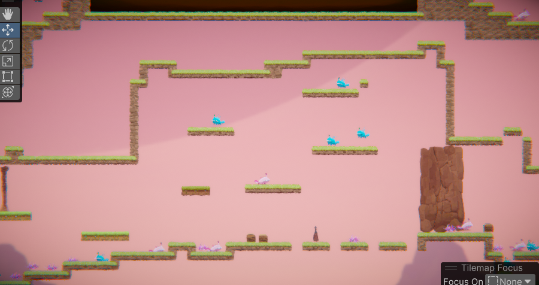

# COMP2150  - Level Design Document
### Name: Gurkirat Singh
### Student number: 47588225

## 1. Player Experience (~700 words)

### 1.1. Discovery

The discovery element of the game has been very carefully set up me throughout all three sections of the level. From the very beginning, the player discovers himself being surrounded by spikes and as he keeps going he keeps on facing more difficulties like the acid pool when he crosses those spikes. Just after that encounter , the player discovers how to use moving platforms, pass through platforms, encounters with staff pickup, health pickup making the player curious of what is ahead In the game.

Throughout the level the player keeps discovering new dynamics such as jump and shoot gun , crouch and shoot, push the box and then stand on it . All of this dynamics are discovered while the player tries to complete the game and keeps on facing more and more challenges and difficulties.
The encounters designed by me in this game and the broader level design facilitates learning in a way that follows good design practice because the player is introduced to all the basic mechanics, jumping over obstacles/enemies, collecting weapons, exploring different paths, dealing with different kinds of platforms which provides the player enough to learn.

### 1.2. Drama

The intensity curve of the game to be dramatically progressing and regressing through the game as the player keeps moving through the different sections of the game. The game starts with very basic understanding of mechanics and then utilizing those mechanics to tackle different enemies. As the player reaches the ending of the first section, the game starts getting complex as there are multiple spitters spitting on the player, chompers , acid pools and spikes . So, from this point, the dramatic curve takes a sharp spike and the game keeps getting more and more complex. The moments of relief are the moments after an intense fight or moment usually after player defeats the enemies, or majorly when the player travels from one section of the map to other one because the player faces lesser enemies so dramatic arc takes a dip

### 1.3. Challenge

The main challenges of the game are :-

Dodge spikes and avoid losing health

Dodge Spits from spitters and kill them

Kill the chompers (if they are in your way)

Collect the three keys laid out in the three sections of the map one by one and for that you have to fight all the enemies, make sure you reach the nearest checkpoint first to avoid losing all the progress. The major challenge is to collect the three keys and while doing that the player has to deal with all these other challenges that come in its way.

I have started the first section on a slow pace difficulty and lesser enemies and from the second section, I have added multiple enemies that the player has to defeat but at the same time I have taken care of the player as well by providing him multiple health pickup points, multiple checkpoints to save his progress, thus balancing out the difficulty curve and keeping the player in the flow channel.

### 1.4. Exploration

In my level design , there are multiple pathways for the player to reach its final destination which is the exit door. I have given the player the automomy to decide whether to use the uphill route or the downhill one which the player will explore and decide as per his own will. The aesthetic and layout choices create distinct and memorable spaces because usually the upper routes are designed to be more difficult while the lower routes are kept moderately difficult but in order to find out those routes the player has to explore a lot and use his brain. So this makes the lower routes memorable spaces for the player if he is able to find out , he is going to remember that route for the next time whenever he plays the game. Overall ,I can say I have provided the player the clear choice to explore different paths, different ways to complete the game, like the player can get the first and third key first and then go for the second one or the player could follow the normal norm of 1-2-3 key. Thus, it can be said that I have successfully implanted exploration in my game/level design.

## 2. Core Gameplay (~400 words)

### 2.1. Spikes 
The spikes are introduced to the player at the very start because for a player, it is important to learn to dodge obstacles.

### 2.2. Moving Platforms
The next encounter involves the interaction of the player with a moving platform that is going to help the player to cross the acid pool by levitating over it so that the player can stand on it.

### 2.3. Acid
The first acid pool as an encounter  is introduced so that the player masters how to jump over objects , the player has to patiently wait for the moving platform to come to his end then jump on it and then wait again to reach the other end. 

### 2.4. Passthrough Platforms
The next encounter includes passthrough platforms, i introduced it at the part where the player has to go downhill to collect the staff from the staff 
Pickup point, the player uses this platform to quickly drop into the lower ground and then jump over the acid to pick up the staff. 

### 2.5.Health Pickups
The first health pickup is encountered by the player when he starts going downhill to collect the staff. The reason behind putting this here is that the player has to fight a chomper.The player has to quickly run down and get the staff and use this if needed.

### 2.6. Weapon Pickup(Staff)
The player must pickup staff from the person lying there , defeat the first chomper. This is introduced here to allow the player have time to get used to using staff as there are some more chompers upstairs.

### 2.7. Chompers
After picking up the staff , the player has to fight the chomper in order to go up again , so the player learns to use the staff.

### 2.8. Checkpoints
The player can kind of save the game by reaching the checkpoints whose whole purpose is to make it easy for the player to complete the game.

### 2.9. Spitters
The player has to fight with spitter in the next encounter which spits acids in its line of sight. Player should be fluent with staff usage.

### 2.10 Weapon Pickup(Gun)
The player has to fight with some spitters , save himself from spikes and pickup gun from its spot.

### 2.11. Keys
The first key is set in a scene where the player has to push the box into acid then stand on it and jump to collect the key which marks the increasing difficulty of the level.

## 3. Spatiotemporal Design

Storyboards:- 

Annonated Level Maps:-

Level 1:- 

Level 2:- 

Level 3:-

 
### 3.1. Molecule Diagram

### 3.2. Level Map – Section 1

### 3.3.	Level Map – Section 2

### 3.4.	Level Map – Section 3

## 4. Iterative Design (~400 words)

In my level design, when I started thinking about what to do , about the topology, prototypes and storyboards, there were a cluster of ideas. So I started laying them out one by one, I started by initiating the first section of the game which was going to teach players the basic mechanics of the game and then as it goes further the unsaid dynamics and all the tips and tricks.= The initial levels that I made were very hard  , so the process I followed was I played the game and fixed the problems like excessive spikes, spitters and  checkpoints too far and etc. The process of iterative design helped me understand what exactly was going wrong in the level so I could rectify it after playing and even if I felt something was too easy , I added extra enemies and obstacles at that place to lift the dramatic arc. Overall, the entire level of this game has been built considering three sections with increasing difficulties as the player progresses through them. Some of the problems I experienced were like some of the spawners were not working, so I replayed the game with new spawners to fix it. As I kept playing the game again and again , I got an idea of how will I shape my next section so that it all looks interconnected in a same big level. 

If I talk about a specific encounter where iterative design helped me was when the player goes to collect staff, I realized after playing that when the player had to take a jump over the acid the tilemaps above the player was too low and the player was hitting his head into that and falling directly into the acid making him unable to reach the other side to collect the staff. So , I fixed by removing some tilemaps from there and then it worked properly.

Another such instance is when the player goes to collect the first key, first I thought and planned that player will jump standing on ground and will collect key but the player kept felling down into the acid making it impossible to get the key without dying. So, to fix that I added the pushable box so that player can push that into the acid and stand on it to collect the key.

There are a lot of other such changes that were carried out due to iterative design that is trial and error, making changes, improving the level design and progesssion.Thats how I justify that iterative design was helpful in creating this level design.

## Generative AI Use Acknowledgement

I have not used any such thing, i have written all of this by my own without the use of any AI and i have also completed the level design all by my own.

